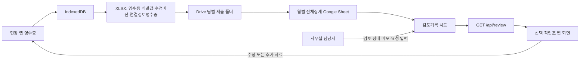

# 사무실 검토·재제출 흐름 설계 및 내부 점검 기록

작성일: 2026-09-10  
상태: 구현 진행 중 / 배포 전

## 1. 목표와 범위

현장 작업조가 영수증·수기 항목을 제출하고, 사무실 담당자가 Drive의 월별 집계에서 검토 메모와 추가 자료 요청을 기록한다. 현장 앱은 선택된 작업조의 기록만 화면에 표시하고, 사용자는 오류를 수정하거나 요청 자료를 추가한 뒤 다시 전송한다.

이번 범위는 다음을 포함한다.

- Drive 전송 결과의 거짓 성공 차단
- 월별 XLSX/PDF/원본 사진/집계의 개별 성공 판정
- 검토기록 시트 생성과 담당자 입력 열 보존
- 팀 앱의 검토기록 읽기와 수정·추가 자료 연결
- 수정 버전과 재전송 필요 표시

이번 범위는 다음을 포함하지 않는다.

- 로그인 기반 팀별 접근 통제
- 열람자 서버 감사 원장
- 서버 제출 원장, batchId, 멱등키
- 승인·반려·재제출 상태값의 업무 정책 강제

## 2. 역할과 신뢰 경계

| 역할 | 할 수 있는 일 | 시스템이 보장하는 범위 |
| --- | --- | --- |
| 현장 사용자 | 영수증 입력·수정·추가 자료 업로드·Drive 재전송 | 기기 로컬의 고정 사용자 이름과 작업조 선택을 기록한다. |
| 사무실 담당자 | Drive `검토기록` 시트의 검토 상태·메모·추가 자료 요청·담당자·시각 입력 | 담당자 입력 열은 안정적인 영수증 식별값이 있을 때 다음 집계에 병합한다. |
| 서버 | 월 집계 생성, 검토기록 읽기, 파일 전송 | 성공 응답을 엄격히 확인한다. 인증 없는 팀 조회는 강한 비공개를 보장하지 않는다. |

### 확인된 사실

- 작업조 명단은 기존 Drive 기반 팀 설정을 사용한다.
- 사용자 이름은 처음 선택한 팀 명단에서 선택되고, 해당 기기에서는 변경하지 않는다.
- 작업조는 고정 사용자 이름이 새 명단에 있을 때만 변경하며 로컬 이력을 남긴다.
- `uploadSendCount`는 과거의 완전 전송 횟수이며, 사무실 수신·검수 완료를 뜻하지 않는다.
- 기존 XLSX에는 영수증 식별값이 없을 수 있다.

### 합리적 추정

- 담당자는 원본·금액·날짜·분류·승인번호를 대조할 수 있어야 한다.
- 수정이나 추가 자료 제출 뒤에는 이전 전송 이력과 현재 자료를 구분해야 한다.

### 미확인 가정

- 검토 상태의 허용값과 승인·반려·재제출의 공식 규칙
- 팀별 자료 비공개의 법적·운영상 요구 수준
- 빈 영수증 식별값을 가진 과거 자료의 재식별 방법

미확인 규칙은 검토기록의 자유 입력 열로 두며, 코드에서 승인·반려를 자동 결정하지 않는다.

## 3. 데이터 흐름

## 4. 검토기록 시트 설계

### 자동 갱신 열

- 영수증 식별값
- 팀, 날짜, 사용처, 용도, 금액, 승인번호
- 연결 검토 영수증
- 수정 버전, 직전 수정 버전
- 연결 추가 자료
- 연결 상태

### 담당자 입력 열

- 검토 상태
- 담당자 메모
- 추가 자료 요청
- 검토 담당자
- 검토 시각

### 병합 규칙

1. 집계 전 현재 `검토기록`을 Drive에서 XLSX로 내보낸다.
2. 같은 영수증 식별값의 담당자 입력 열만 새 집계에 복사한다.
3. 현재 원본에서 사라진 과거 행은 삭제하지 않는다.
4. 영수증 식별값이 비어 있으면 자동 병합하지 않고 `자동 검토기록 연결 불가`로 표시한다.
5. 기존 검토기록을 읽을 수 없거나 내보낸 뒤 변경되면 집계 교체를 중단한다.

## 5. 현장 재제출 설계

- 수정 시 영수증의 `revision`을 증가시킨다. 기존 데이터에 값이 없으면 1로 해석한다.
- 현재 제출 지문이 마지막 완전 전송 지문과 다르면 “수정된 자료를 다시 전송해 주세요”를 표시한다.
- 추가 자료 요청에 사진 또는 수기 자료를 연결하면 새 항목의 `relatedReviewReceiptId`에 원래 영수증 ID를 저장한다.
- 일반 입력 시작·수기 모달 닫기에서는 연결 대상을 해제한다.

## 6. 내부 점검 체크리스트

### P0

- 실패·부분 성공·응답 불명 상태가 전송 완료 횟수를 늘리지 않는가?
- 검토기록 읽기 실패가 담당자 메모를 빈 값으로 덮어쓰지 않는가?
- 집계 교체 직전 Drive 파일 변경을 감지하는가?
- 팀별 비공개를 실제 보장한다고 잘못 표현하지 않는가?

### P1

- 빈 영수증 식별값의 과거 행이 다른 행과 잘못 병합되지 않는가?
- 첫 관측 버전이 2 이상일 때 가짜 이전 버전을 표시하지 않는가?
- 추가 자료 입력 취소 뒤 일반 입력이 이전 요청에 연결되지 않는가?
- 팀 변경 뒤 과거 영수증 귀속이 의도치 않게 바뀌지 않는가?
- 실제 Drive 미설정 테스트가 성공으로 보이지 않는가?

## 7. 내부 점검 결과와 반영 상태

| 검토 항목 | 판정 | 처리 |
| --- | --- | --- |
| Drive 전송 ACK·재시도·완료 횟수 | 반영 | P0 테스트와 브라우저 전송 흐름으로 검증 |
| 검토기록 export 실패 시 메모 유실 | 반영 | 오류 전파 후 집계 교체 중단 |
| export 뒤 Drive 동시 편집 | 일부 완화 | 교체 전 수정 시각 재확인. 완전한 원자적 잠금은 없음 |
| 빈 영수증 식별값 병합 | 반영 | 자동 병합 금지, 과거 행 보존·연결 불가 표시 |
| 첫 관측 v2의 가짜 이전 버전 | 반영 | 이전 검토 행이 있을 때만 직전 버전 기록 |
| 요청 자료 취소 후 오연결 | 반영 | 일반 입력 시작과 수기 모달 닫기에서 대상 해제 |
| 팀별 강한 비공개·열람 감사 | 미해결 P0 | 서버 자격과 조회 원장이 필요 |
| Drive 실제 계정 검증 | 미해결 | OAuth 환경변수와 테스트 Drive 폴더 필요 |

## 8. 다음 내부 검토가 확인할 사항

1. 이 문서의 신뢰 경계와 미해결 P0 표시가 실제 코드와 일치하는지
2. Drive 교체 시 동시 편집 창을 줄이는 추가 검증이 충분한지
3. 현장 사용자가 이미 제출한 추가 자료를 재차 올리지 않도록 화면 표시가 필요한지
4. 팀 변경 후 과거 자료 귀속 정책을 설정으로 분리해야 하는지
5. 실제 Drive 테스트에 필요한 환경변수·전용 폴더 분리가 준비됐는지

## 9. 설계도 기준 내부 검토 피드백 (2026-09-10)

세 명의 내부 검토자가 이 설계도와 현재 코드를 독립 대조했다. 아래 항목은 구현 완료로 표시하지 않는다.

| 우선순위 | 피드백 | 결정·후속 |
| --- | --- | --- |
| P0 | Drive export 후 기존 Sheet를 교체하는 사이 담당자가 수정하면 새 메모가 빠질 수 있다. | 수정 시각 재확인으로 위험을 줄였지만 원자적 잠금은 없다. 조건부 갱신 또는 서버 원장 설계가 필요하다. |
| P0 | 새 Sheet 생성 뒤 기존 Sheet 정리·이름 변경이 일부 실패하면 중간 상태를 복구하는 설계가 없다. | 스냅샷·롤백·최종 파일 검증을 별도 작업으로 설계한다. |
| P0 | 팀 이름 쿼리만으로 검토기록을 읽을 수 있어 비공개·열람 추적을 보장하지 못한다. | 현재는 화면 범위 제한으로만 표현한다. 서버 자격·조회 원장 없이는 완료로 표기하지 않는다. |
| P1 | 팀 이름 문자열은 명단 변경 시 과거 기록 연결을 잃을 수 있다. | XLSX의 안정적인 teamId를 집계·검토기록·조회까지 전달하고, 과거 귀속 정책을 설정으로 분리한다. |
| P1 | 영수증 ID 충돌과 동명 월 집계 파일은 담당자 메모를 잘못 병합하거나 유실할 수 있다. | 충돌·복수 파일은 자동 병합하지 않고 검토 실패로 중단하는 규칙과 테스트가 필요하다. |
| P1 | 추가 자료를 이미 연결했는지 현장 앱에서 보이지 않아 반복 제출할 수 있다. | 연결 자료 ID·버전과 재제출/담당자 재확인 대기를 화면에 표시한다. |
| P1 | 검토 담당자·검토 시각만 입력된 행은 현장 앱 필터에서 숨겨진다. | 현장 공개 열의 정책을 정하거나 두 열도 표시 대상으로 포함한다. |
| P1 | 전역 집계 경로는 월별 검토기록 병합 규칙을 적용하지 않는다. | 해당 경로를 제한하거나 같은 보존 규칙을 적용한다. |

### 테스트 보강 순서

1. 기존 검토기록 export 실패 시 새 파일 생성·기존 파일 삭제가 전혀 일어나지 않는지
2. export 뒤 수정 시각 변경 시 교체 중단되는지
3. 빈 ID 행과 ID 충돌 행이 자동 병합되지 않는지
4. 첫 관측 revision 2에 직전 버전이 비어 있는지
5. 요청 자료 입력 취소 뒤 일반 수기·사진 입력이 연결되지 않는지
6. 팀 변경 뒤 과거 자료 귀속과 검토기록 연결이 유지되는지
7. Drive 미설정 시 앱이 실패를 검토 완료나 기록 없음으로 표시하지 않는지

### 내부 검토 결론

현재 구현은 테스트된 정상 흐름에서 검토기록 생성·표시·수정 버전·추가 자료 연결을 제공한다. 그러나 P0의 Drive 교체 원자성, 팀별 비공개와 열람 감사, 실제 Drive 통합 검증은 미해결이다. 이 상태를 운영 완료 또는 강한 접근 통제로 표현하지 않는다.

## 10. 다음 구현 전 검토 계획: 검토기록 교체 안전성

### 목표

월별 집계를 새 Google Sheet로 교체하는 과정에서 담당자 입력 기록을 잃지 않도록 한다. 실패나 동시 변경을 성공으로 표시하지 않는다.

### 이번 작은 범위

1. 기존 검토기록 export 실패 시 새 파일 생성·기존 파일 이동·이름 변경을 전혀 실행하지 않는 테스트를 추가한다.
2. export가 손상 XLSX이거나 기존 파일에 `검토기록` 시트가 없을 때의 마이그레이션 정책을 명시하고 테스트한다. 기존 담당자 입력 여부를 확인할 수 없으면 교체하지 않는다.
3. exact finalName인 모든 활성 Drive 항목을 검사한다. 0개 또는 Google Sheet 정확히 1개일 때만 진행한다. 다른 MIME, 2개 이상, 남은 임시 파일, modifiedTime 누락은 오류로 중단하고 어떤 파일도 자동 삭제하지 않는다.
4. export 후 생성 직전과 기존 파일 이동 직전에 수정 시각·exact finalName 개수·예상 파일 ID를 다시 확인한다. 변경되면 새 임시 파일을 정리하고 기존 파일을 유지한 채 중단한다.
5. 새 파일 생성 ACK의 fileId·임시 이름을 검증하고, 새 임시 Sheet를 export/read-back하여 `검토기록` 시트와 최소 행 불변조건을 확인한 뒤에만 기존 파일을 이동한다. 불변조건은 영수증 식별값 집합, 수정 버전, 빈 ID 보존 행의 키·개수, 담당자 입력 열의 기대값이다.
6. 기존 파일 이동은 `id`와 `trashed:true` ACK를 검증한 성공 파일 ID만 순차 기록한다. 이동 실패·새 파일 이름 변경 실패·rename ACK 불명·최종 파일 재조회 불일치에서는 `id`와 `trashed:false` 복구 ACK를 검증하며 기존 final 복구와 임시 파일 정리를 **시도**하고, 성공 여부와 old/new/temp fileId를 포함한 명시적 비성공 오류를 반환한다. 복구 실패를 성공 또는 복구 보장으로 표현하지 않는다.
7. 현재 원본 또는 이전 검토기록에서 비어 있지 않은 영수증 식별값이 중복되면 집계를 중단한다. 충돌 보고에는 source XLSX fileId/name과 1-based row를 포함한다. 금액 이중 집계나 담당자 메모의 자동 복사를 허용하지 않는다.
8. 영수증 식별값 없는 과거 검토 행은 내부 보존 키를 부여해 한 번만 보존하고 새 행과 병합하지 않는다. 반복 집계에서 보존 행이 증식하지 않는 테스트를 둔다.
9. 월 집계 실패가 upload API 응답과 클라이언트 완료 횟수까지 실패로 전파되는 통합 회귀를 추가한다.

### 이번 범위에서 해결하지 않는 사항

- export 검증 후 실제 파일 삭제 사이의 Drive 동시 편집은 재확인으로 창을 줄일 뿐, Drive API의 원자적 조건부 교체 또는 서버 원장 없이는 완전히 막을 수 없다.
- 팀별 비공개와 열람 감사에는 사무실 관리 자격과 서버 조회 원장이 필요하다.
- 위 두 항목은 현재 최소 변경의 범위를 넘으므로, 구현 전용 별도 설계로 남긴다.

### 완료 기준

- 위 1~9의 실패 조건마다 집계 파일 교체가 일어나지 않거나, 복구 시도의 성공 여부와 관련 Drive fileId를 담은 명시적 오류가 반환된다.
- 각 실패 조건은 Drive mock 호출 순서와 남은 파일 상태(create/trash/rename/복구)를 검증한다.
- trash와 복구 응답은 대상 fileId와 `trashed` 상태를 확인한다.
- 기존 정상 집계·검토기록 보존 테스트와 전체 단위·브라우저 회귀가 통과한다.
- 내부 검토에서 이 범위의 P0·P1 추가 지적이 없거나, 지적을 반영한 뒤 재검토한다.

### 구현 기록: 교체 전 재확인 1차 (2026-09-11)

- 월별 기존 집계 조회를 `name contains`가 아닌 최종 이름 일치 조회로 바꾸고, Google Sheet MIME 유형·`modifiedTime`·Drive `version`이 없는 기존 파일은 교체하지 않도록 했다.
- 새 파일의 생성 ACK와 최종 이름 변경 ACK를 각각 확인한 뒤, 기존 파일을 정리하기 직전에 최종 이름의 활성 파일을 다시 조회한다. 이때 기존 파일과 새 파일만 정확히 존재하고 기존 파일의 수정 시각·버전이 export 시점과 같을 때만 다음 단계로 간다.
- 생성 ACK 불명, 이름 변경 ACK 불명, 정상 호출 순서의 회귀 테스트를 추가했다. 아직 기존 파일 trash ACK·순차 이동·복구는 다음 작은 범위이며, 현재 `deleteFiles`의 병렬 처리도 완료로 표시하지 않는다.

### 구현 기록: 기존 파일 이동 ACK·복구 2차 (2026-09-11)

- 기존 파일 정리는 병렬 요청이 아닌 순차 요청으로 처리한다. 각 요청은 같은 `fileId`와 `trashed: true` 응답을 받아야 한다.
- 응답이 비어 있거나 네트워크가 끊겨도 Drive가 이미 이동했을 수 있으므로, 이동 요청 직전에 파일 ID를 복구 후보에 기록한다. 실패하면 ACK 여부와 무관하게 후보 전체에 `trashed: false` 복구를 시도하고, 성공 여부를 오류 상세에 남긴다.
- 남은 제한: 최종 재조회와 Drive trash 요청 사이에는 조건부 갱신 또는 서버 잠금이 없으므로 아주 짧은 동시 변경 경합이 남는다. 이 제한을 해결하지 않은 상태에서 완전한 원자적 교체라고 표현하지 않는다.

### 다음 작은 범위 계획: 새 집계 read-back 검증

내부 검토에서 생성 ACK만으로 기존 집계를 정리하면, Drive 변환 결과가 빈 파일·손상 파일·검토기록 누락 파일이어도 성공으로 끝날 수 있다는 P0를 확인했다. 다음 구현은 새 임시 Sheet의 export/read-back 검증만 다룬다.

1. 생성 ACK 뒤, 이름 변경과 기존 파일 정리 전에 임시 Sheet를 XLSX로 export해 파싱한다.
2. 필수 시트 7개와 `검토기록`의 식별값·수정 버전·담당자 입력 5개 열을 확인한다.
3. 비어 있지 않은 영수증 식별값은 새로 쓴 검토기록과 1:1로 일치하고, 수정 버전과 담당자 입력 값이 같아야 한다. 빈 식별값 과거 행의 안정 보존키는 아직 P1 설계 항목이므로 이번 검증에서는 별도 수를 보존하는지 확인한다.
4. export·파싱·시트·헤더·행 불변조건이 하나라도 실패하면 기존 final Sheet는 rename/trash하지 않는다. 새 임시 파일의 정리는 시도하되 ACK 불명·실패는 `newFileId`와 정리 결과를 오류 상세에 남긴다.
5. 정상, export 네트워크 오류·빈 응답·손상 XLSX, 검토기록 누락·헤더 누락, ID 누락·중복, 수정 버전/담당자 입력 불일치의 mock 회귀 테스트를 둔다.

이 계획은 기존 구형 집계에 `검토기록` 시트가 없을 때 담당자 입력이 실제로 없었는지 판별할 수 없다는 미확인 가정을 해결하지 않는다. 해당 경우를 자동으로 안전하다고 처리하지 않으며, 마이그레이션 정책은 별도로 검토한다.

### P0 설계 보류: 업로드와 월집계 사이의 Drive 동시 변경

업로드 요청은 이전 XLSX 보관 ACK와 활성 XLSX 재확인을 거친 뒤 `runMonthAggregate`를 호출한다. 그러나 재확인이 끝난 뒤 집계 함수가 Drive 폴더를 다시 열거하기 전 또는 열거하는 중에 다른 서버 요청이 같은 주차 폴더에 XLSX를 추가하면, 집계는 두 파일을 함께 읽고 성공할 수 있다. 클라이언트의 연속 탭 방지만으로는 다른 기기·다른 서버 인스턴스 요청을 막지 못한다.

현재 구조 안의 재조회만으로는 check-then-act 경쟁을 제거할 수 없다. 완전한 해결에는 다음 중 하나가 필요하다.

1. 월·작업조 단위의 서버 측 잠금 또는 제출 원장으로 업로드·보관·집계의 입력 집합을 고정한다.
2. Drive에 조건부 생성/갱신이 가능한 작업 잠금 파일을 두고, 소유자·만료·복구 규칙을 구현한다.
3. 월집계가 입력 source fileId 목록과 버전을 받아, 실제로 읽은 목록이 그 스냅샷과 정확히 같을 때만 성공하게 한다. 이 역시 스냅샷 생성과 업로드의 원자성 규칙이 필요하다.

이 작업은 신규 공유 상태와 복구 정책을 요구하므로, 현 최소 변경 범위를 넘어선다. 현재 구현은 재확인 시점까지의 중복 원본을 차단하지만 그 이후 동시 변경은 완전 보장하지 않는다고 기록한다.

### P0 다음 구현 계획: Redis 제출 잠금·작업 상태

2026-09-11에 Vercel Marketplace의 Upstash Redis를 `receipt-app` 프로젝트에 연결했다. 기존 `api/_kv.js`의 인메모리 fallback은 테스트 전용이며, 제출·집계에는 실제 Redis를 사용할 수 있을 때만 진행한다.

1. `SET NX EX`와 토큰 일치 Lua 해제·갱신을 제공하는 KV 잠금을 추가한다. Redis 접근 불가, 잠금 획득 실패, 소유권 상실은 Drive 변경 전에 명시적 실패로 처리한다.
2. 잠금 범위는 Drive 경로를 기준으로 한다. 월 집계 교체 경쟁을 막는 월 잠금과 작업조·주차의 제출 잠금을 항상 같은 순서로 획득한다. 팀 표시명·클라이언트 teamId는 잠금 키의 근거로 사용하지 않는다.
3. 제출 ID와 XLSX SHA-256을 Redis 작업 상태로 저장한다. 같은 완료 제출은 저장된 결과를 재반환하고, 진행 중 제출·다른 내용의 같은 ID는 실패로 처리한다.
4. Drive 업로드 파일에는 제출 ID와 SHA-256을 appProperties로 남긴다. Redis 기록 전 프로세스가 중단되어도 재시도 시 Drive 파일에서 상태를 복구할 근거를 둔다.
5. 기존 XLSX 보관 후 월별 활성 원본 fileId·version 목록을 작업 상태에 스냅샷으로 저장한다. 월집계는 이 목록만 읽고, 읽기 직전 version을 다시 확인한다.
6. 집계 Sheet read-back까지 성공한 뒤에만 작업 상태를 `complete`로 기록한다. 카카오 알림은 별도 산출물 상태로 남기며, 전송 여부 불명 시 자동 재발송하지 않는다.

이 단계는 API 계약과 클라이언트 제출 ID 전달, Redis 상태, Drive appProperties, 집계 입력 수집을 함께 바꾸므로 작은 기반 변경마다 단위·통합 테스트와 내부 검토를 반복한다.

### P0 다음 구현 계획: 원본 이미지·PDF를 제출 작업 상태에 연결

#### 착수 확인

- **확인된 사실:** Redis 제출 작업에는 `xlsx`, `images`, `pdf`, `aggregate`, `kakao` 상태 자리가 있지만 현재 XLSX 요청만 `xlsx`·`aggregate`·XLSX 알림 결과를 기록한다. 뒤따르는 이미지와 PDF 요청은 같은 `submissionId`를 보내지만 서버가 작업과 연결하거나 완료 상태를 갱신하지 않는다.
- **확인된 사실:** 클라이언트는 XLSX → 원본 이미지별 요청 → PDF 청크 순서로 보내며, 현재 완료 횟수는 클라이언트가 각 응답을 조합해 판단한다. 서버가 제출 전체 완료를 증명하는 응답은 아직 없다.
- **확인된 사실:** 수기 항목은 원본 이미지가 없을 수 있다. 이미지가 참조된 항목은 제출 전 로컬 Blob 존재를 확인하며, 동일 `imageId`는 한 번만 전송한다.
- **합리적 추정:** XLSX, 참조된 원본 이미지 전부, PDF, 월 집계는 담당자 대조에 필요한 필수 산출물이다. 카카오 알림은 전달 편의를 위한 부가 산출물이며 Drive 자료의 완전성을 대신하지 않는다.
- **미확인 가정:** 카카오 알림 실패가 업무상 최종 제출 실패인지 확정되지 않았다. 이번 단계에서는 별도 상태로 보존하되 제출 완료를 막지 않도록 구성해 이후 정책으로 바꿀 수 있게 한다.
- **기존 데이터 호환성:** 기존 완료 작업처럼 예상 이미지 목록이나 PDF 식별값이 없는 기록은 완전 성공으로 새로 추정하지 않는다. 기존 로컬 전송 횟수와 완료 지문은 변환하거나 삭제하지 않는다.

#### 최소 변경 설계

1. 최초 XLSX 요청에 클라이언트가 이미 만든 `pdfReportId`와 이미지 식별 정보의 비식별 해시 목록을 함께 보내고, 서버 작업에 `expected`로 고정한다. 같은 `submissionId`의 다른 기대값은 충돌로 거부한다.
2. 이미지·PDF 요청은 유효한 최종 `submissionId`와 기존 작업을 요구하고, 작업의 팀·월·주차 범위와 요청 범위가 같을 때만 처리한다. 작업이 없거나 범위가 다르면 Drive를 변경하기 전에 실패한다.
3. 각 이미지의 Drive 업로드 ACK를 현재 파일 read-back으로 확인한 후에만 해당 해시와 fileId를 `images.confirmed`에 기록한다. 실패·빈 응답·처리 여부 불명 항목은 기록하지 않아 같은 항목만 재시도할 수 있게 한다.
4. PDF는 마지막 청크 조립 파일의 MIME·위치·크기를 read-back하고, XLSX 단계에서 고정한 `pdfReportId`와 일치할 때만 `pdf: confirmed`로 기록한다. 중간 청크 수신은 제출 성공으로 기록하지 않는다.
5. 작업 갱신 경쟁으로 상태가 사라지지 않도록 제출 ID 단위 짧은 Redis 잠금 또는 원자 갱신을 사용한다. 월 잠금과 함께 필요할 때는 항상 월 잠금 → 제출 잠금 순서로 획득한다.
6. `xlsx`, `aggregate`, 기대 이미지 전부, `pdf`가 현재 Drive 증거와 함께 확인될 때만 서버가 `complete: true`를 반환한다. 카카오 상태는 별도 응답 필드로 남긴다.
7. 클라이언트는 서버의 `complete: true`를 받은 경우에만 완료 지문과 완료 횟수를 기록한다. 부분 성공에서는 산출물별 결과와 실패 이미지 재시도 목록을 유지한다.
8. 새 API 파일은 추가하지 않고 기존 `/api/upload`의 응답 계약을 확장한다. schema-v2 응답의 기존 필드는 유지한다. 증거 계약이 없는 구버전 실행 파일의 XLSX·이미지·PDF 요청은 완전성을 증명할 수 없으므로 Drive 변경 전에 실패 차단한다. 기존 로컬 영수증·전송 횟수 데이터는 그대로 읽고 새 클라이언트가 새 제출 ID로 다시 제출할 수 있게 한다.

#### 검증 및 중단 기준

- 성공, 작업 없음, 범위 불일치, 이미지 일부 실패·응답 유실, 같은 이미지 재시도, PDF 중간/마지막 청크 실패, PDF read-back 불일치, Redis 갱신 실패, 빠른 중복 요청을 테스트한다.
- 완전 성공 전에는 서버와 클라이언트 어디에서도 완료 횟수가 증가하지 않아야 한다.
- 실패 이미지 재시도는 XLSX·성공 이미지·PDF를 다시 만들지 않아야 한다.
- 기존 작업 상태를 안전하게 구분할 정보가 없거나 Redis 원자 갱신 없이 상태 유실을 막을 수 없으면 구현 범위를 늘리지 않고 실패 차단 상태로 남긴다.
- 구현 전 설계 검토와 구현 후 P0·P1 재검토를 각각 통과한 뒤에만 다음 단계로 이동한다.

#### 내부 설계 검토 반영: 구현을 다섯 단위로 분리

초기 계획은 이미지/PDF가 Drive에 저장된 뒤 Redis 기록 또는 HTTP 응답이 유실되는 경우의 복구 증거와 상태 갱신 경쟁을 충분히 고정하지 못했다. 다음 순서를 각각 구현·테스트·재검토한 뒤에만 다음 단위로 이동한다.

1. **작업 스키마와 제출 잠금 기반**
   - 최초 XLSX가 기대 산출물을 `{ images: [{ key, sha256, byteLength, mimeType }], pdf: { reportId, sha256, byteLength, chunkCount, chunkSha256: [...], chunkByteLength: [...] }, receiptCount, totalAmount }` 형태로 고정한다. `key`는 원본 `imageId`의 SHA-256이며, 파일명은 표시 정보로만 쓴다. 서버 예약 검증은 두 청크 배열의 길이가 `chunkCount`와 같은지, 각 SHA-256 형식과 각 바이트 길이의 양의 정수·상한을 확인하고, `chunkByteLength` 합이 PDF `byteLength`와 같은지 검사한다. 이후 PDF 요청은 index별 고정 해시와 바이트 길이를 대조할 뿐 expected를 변경하지 않는다.
   - 서버는 이미지 data URL을 엄격히 디코드해 SHA-256·바이트 수·MIME을 재계산한다. PDF 기대값도 클라이언트가 PDF 바이트를 만든 뒤 최종 제출 작업을 예약하기 전에 고정할 수 있도록 클라이언트 생성 순서를 조정한다.
   - 모든 최종 후속 요청은 Drive 접근 전에 `submissionId`, 작업 존재, 작업 범위, 기대 산출물 포함 여부를 검증한다. 구버전 클라이언트가 기대값 없이 보내는 신규 final 요청은 Drive 변경 전 명시적 4xx로 차단한다.
   - 제출 ID 해시 기반 Redis 잠금을 추가한다. XLSX가 월 잠금과 함께 사용할 때는 항상 월 → 제출 순서, 이미지/PDF는 제출 잠금만 획득한다. 작업 읽기·검증·Drive 처리·상태 쓰기까지 잠금을 보유하고 장기 처리 중 갱신한다.
   - 상태 저장 직전에 잠금 소유권을 확인한다. 소유권을 잃으면 작업을 덮어쓰거나 성공 응답하지 않는다. 전체 객체 갱신은 잠금 토큰 확인과 작업 쓰기를 하나의 Lua 연산으로 묶거나 revision CAS를 사용한다.
   - expected가 없는 기존 작업은 Drive 변경 없이 `LEGACY_SUBMISSION_RESTART_REQUIRED`를 반환한다. 클라이언트는 해당 코드에 한해 기존 완료 지문·횟수는 유지하면서 현재 지문의 submission attempt만 폐기하고 새 ID로 전체 제출을 다시 시작할 수 있다.

2. **원본 이미지 증거와 부분 재시도**
   - 이미지 파일 appProperties에 `submissionId`, `artifactKind=image`, 이미지 key, 콘텐츠 SHA-256을 기록한다.
   - 업로드·복구 모두 현재 week 폴더, MIME, 크기, Drive MD5, appProperties를 `files.get`으로 확인한다. 재시도는 제출 ID+이미지 key로 Drive 전체를 검색하며, 다른 주차·보관함·휴지통·해시 불일치·복수 증거는 새 파일을 만들지 않고 실패한다.
   - Drive 성공 뒤 Redis 쓰기/응답이 유실돼도 같은 항목의 증거를 복구해 confirmed로 기록한다. 서로 다른 바이트가 같은 key로 오면 충돌 처리한다.
   - expected images가 빈 수기 전용 제출은 `confirmed: []`을 명시하고 이미지 필수 조건을 충족한 것으로 계산한다.

3. **PDF 청크와 최종 PDF 증거**
   - `reportId`, `chunkCount`, 각 chunk SHA-256, 최종 PDF SHA-256·크기를 작업 기대값으로 고정한다. 같은 index의 다른 바이트는 Drive 변경 전 충돌 처리한다.
   - 제출 잠금으로 청크 쓰기와 조립을 직렬화하고, 청크와 최종 PDF에 제출·report·artifact 식별 속성과 콘텐츠 해시를 남긴다.
   - 최종 PDF는 전역 증거 검색과 read-back으로 week 위치·MIME·크기·MD5·SHA 속성을 확인한다. 마지막 청크 응답 유실은 기존 최종 증거를 복구하며 재조립·재알림하지 않는다.

4. **서버 완료 판정과 클라이언트 횟수**
   - `complete: true` 직전에 XLSX, 모든 기대 이미지, PDF의 저장 fileId를 현재 Drive에서 다시 읽어 위치·휴지통·MIME·크기·MD5와 appProperties SHA를 확인한다. Redis의 confirmed 문자열만 합쳐 완료 처리하지 않는다.
   - Google native Sheet인 aggregate에는 MD5·일반 파일 크기를 요구하지 않는다. fileId·월 부모·`trashed: false`·native Sheet MIME을 확인한 뒤 XLSX로 export해 파싱한다. 필수 탭·필수 열과 전체 건수/합계 불변식을 검사하고, 제출 XLSX를 다시 내려받아 얻은 현재 팀의 영수증 식별값·수정버전·금액이 aggregate 전체내역에 정확히 포함되는지 확인한다. 담당자 검토 열의 변경은 허용하므로 aggregate 전체 바이트 digest 일치는 요구하지 않는다.
   - 서버는 제출 ID와 증가하는 job revision을 함께 반환한다. 클라이언트는 동일 submissionId의 `complete === true`와 유효한 revision이 있는 단 한 응답에서만 완료 지문·횟수를 기록한다.
   - 이미지 재시도도 일반 이미지 ACK로 완료 처리하지 않고 서버 complete 응답을 요구한다. `retryFingerprint` 원문과 저장 해시 키를 혼용하는 기존 가드를 함께 수정한다.
   - complete 응답 유실 후 동일 작업 재생, 빠른 연속 실행, 재마운트에서도 로컬 완료 횟수는 한 번만 증가해야 한다.

5. **카카오 알림 상태 분리**
   - 카카오는 `kakao.xlsx`와 `kakao.pdf`로 나눈 선택 산출물이며 `complete`를 막지 않는다.
   - 외부 호출 직전에 제출 잠금 아래 `sending`을 기록하고, 확인된 성공은 `confirmed`, 명시적 실패는 `failed`, 응답 유실·처리 여부 불명은 `unknown`으로 기록한다.
   - 프로세스 중단으로 `sending`이 남아 있으면 다음 작업 읽기에서 `unknown`으로 전환하고 자동 재발송하지 않는다.
   - `confirmed`와 `unknown`은 자동 재발송하지 않는다. 상태와 오류는 제출 응답에서 별도로 표시한다.

각 단위의 필수 회귀에는 Drive 성공→Redis 쓰기 실패→재시도 복구, 잠금 TTL 갱신·소유권 상실, 병렬 이미지 상태 보존, 증거의 다른 폴더/보관함/휴지통 이동, 동일 key의 다른 바이트, PDF 동일 index의 다른 바이트, 마지막 청크 응답 유실, 완료 뒤 산출물 삭제, 레거시 작업 재시작, 완료 응답 유실 뒤 횟수 단일 증가, 카카오 sending/unknown 재생 금지를 포함한다.

#### 구현 진행 기록

- **단위 1 기반 완료(2026-09-12):** 기대 산출물 정규화·경계 검증, schema v2 불변 계약 digest, 제출 ID 해시 잠금, 잠금 token·revision·계약 digest를 한 Lua 연산에서 검사하는 조건부 작업 저장을 구현했다. 기존 expected/revision 없는 작업과 기존 plain-write 경로는 유지했다.
- **내부 검토:** 최초 검토의 expected 생략 우회와 다른 잠금 키 오용 P1, 재검토의 상태 전이 중 불변 계약 변경 P1을 반영했다. 최종 재검토는 `SHIP`, 추가 P0·P1 없음이었다.
- **검증:** 기반 및 기존 업로드 회귀 63개, 클라이언트 Drive 흐름 34개, 전체 lint가 통과했다.
- **단위 2 착수:** 서버 이미지 요청의 작업 선검증·증거 메타데이터·전역 복구를 연결하기 전에, 기존 재시도 완료 지문의 원문/저장 해시 비교 오류를 수정했다.
- **단위 2 선행 기반 완료(2026-09-12):** IndexedDB를 v9로 올리면서 기존 저장소에는 손대지 않고 `receipt_submission_artifacts`만 추가했다. PDF 전체·청크 바이트와 SHA-256 계약을 저장·읽기 때 재검증하고 transaction 완료까지 확인한다. 이미지 ID·이미지 바이트·PDF 전체·순서가 고정된 PDF 청크 계약 생성기도 추가했다.
- **선행 기반 내부 검토:** 캐시 검토 P1 3건과 계약 생성기 검토 P1 3건을 모두 반영했다. 실제 업로드 상한(이미지 8MiB, PDF 20MiB, 20청크, 청크 4MiB)을 클라이언트·캐시·서버 작업 계약에서 통일했고, 두 재검토 모두 `SHIP` 판정을 받았다.
- **단위 2 완료(2026-09-12):** 최초 XLSX가 이미지/PDF expected 계약을 예약하고, 원본 이미지 요청은 Drive 접근 전에 작업·범위·key·실제 바이트를 검증한다. 제출 잠금 아래 전역 Drive 증거를 모든 페이지에서 검색하며, 단일 증거의 위치·휴지통·MIME·크기·MD5·appProperties를 재확인한다. 후보 없음일 때만 새 파일을 만들고 read-back 및 revision 조건부 작업 저장까지 성공해야 권위 ACK를 반환한다.
- **단위 2 내부 검토:** 전역 검색 pagination 누락과 잠금 TTL 경계 P1을 반영했다. API 실행 상한 60초와 연동한 artifact lock TTL 180초 및 파일 처리 직전 갱신을 적용했고 최종 판정은 `SHIP`, 추가 P0·P1 없음이었다.
- **단위 2 전체 검증:** Vitest 529 passed·15 skipped, build 성공, lint 성공, Playwright E2E 14 passed. 최초 병렬 실행 중 lint가 E2E의 `test-results` 디렉터리 교체와 겹쳐 ENOENT가 한 번 발생했으나 E2E 종료 뒤 lint 단독 재실행은 성공했다.

#### 단위 3 검증 기록 (2026-09-13, 재검토 SHIP)

- PDF 요청은 저장된 schema v2 제출 계약·범위·XLSX 확인 상태를 Drive 접근 전에 검사한다. 저장된 폴더 계보를 확인하며, 폴더를 다시 생성하지 않는다.
- 청크와 최종 PDF를 전역으로 모든 페이지에서 탐색한다. 조회 불완전·복수 증거·이동·휴지통·고정 fileId 불일치를 성공이나 새 생성으로 처리하지 않는다. 실제 다운로드 바이트의 SHA-256·MD5·크기와 PDF 헤더를 대조한다.
- 내부 helper 검토에서 다운로드 응답 크기 상한 부재 P1이 제기되어, 스트림이 계약 크기를 넘으면 즉시 중단하도록 수정했다. Drive 생성 커밋 후 응답 유실 시 재시도가 기존 PDF를 복구하고 추가 생성하지 않는 테스트를 추가했다.
- 클라이언트는 제출 ID·reportId·revision·fileId가 확인된 PDF ACK만 수락한다. 캐시 유실은 같은 제출 ID로 PDF를 조용히 재생성하지 않고 중단한다. 복구된 최종 PDF 응답을 받으면 남은 청크 요청을 중단한다.
- 수정 후 전체 Vitest: 569 passed / 15 skipped. lint 및 diff 공백 검사 통과. 앞선 통합 빌드와 Playwright 14개 통과; Playwright의 Drive API는 모의 응답이며 실제 Drive 전송을 검증한 것은 아니다.
- 구현 에이전트와 통합 검토 에이전트가 사용량 제한으로 종료되어 최종 독립 재검토 판정은 아직 없다. 이 단계는 완료 승인하지 않았으며 다음 단위로 이동하지 않았다.
- 남은 제한: 프로세스 종료 뒤 Drive 생성 요청이 계속 처리되고 검색에 아직 나타나지 않는 경우의 절대적 중복 방지는 입증하지 못했다. 잠금 TTL만으로 이를 해결했다고 판단하지 않는다. 서버 전체 complete 판정·집계 재검증은 다음 단위이며 아직 구현 완료가 아니다.
- **재개 검토:** `pdf_stage_review`의 판정은 `FIX-FIRST`. 영수증 식별 지문은 ID순이지만 XLSX·이미지 계약·PDF는 화면 순서여서 새로고침 후 같은 제출 ID의 계약이 달라질 수 있는 P1을 확인했다. 전송용 배열을 동일 ID순으로 정렬하고 모든 산출물 생성에 적용했다. 화면 목록은 변경하지 않았다.
- **수정 검증:** 목록 순서를 뒤집고 훅과 메모리를 초기화한 재시도에서 제출 ID·XLSX 바이트·expected 계약·receiptSummary가 같고 PDF는 재생성되지 않는 회귀 테스트를 추가했다. 전체 570 passed / 15 skipped, lint·build·diff 검사 통과. `pdf_stage_recheck`의 독립 재검토 진행 중이다.
- **최종 재검토:** `pdf_stage_recheck`가 `SHIP`, 추가 P0·P1 없음으로 판정했다. 검토자 집중 테스트 109개·ESLint·diff 검사 통과. 부모의 수정 후 Playwright 14개도 통과했다. 위 사용량 제한과 검토 진행 중 기록은 이전 시점 기록이며, PDF 단위의 내부 승인 대기는 해소되었다. 실제 Drive 검증과 명시된 원격 생성 경합 위험은 남는다.

#### 단위 4 구현 전 상세 계획 (아직 구현하지 않음)

1. **확인된 현재 흐름:** XLSX 요청이 월집계와 함께 fileId를 저장하고, 이미지/PDF 요청이 각각 revision을 갱신한다. 클라이언트는 이 응답들을 합쳐 완료 횟수를 늘린다. 이미지 재시도는 과거 `requiredOthersSucceeded`를 재사용한다. 이는 완료 시점의 Drive 자료 존재·내용을 보장하지 못한다.
2. **구현 경계:** 기존 `/api/upload` 안에 최종 확인 요청을 추가하고 새 배포 함수는 만들지 않는다. 업로드 결과와 전체 완료 응답을 분리한다. 최종 확인은 파일 생성·이동·재집계·알림을 수행하지 않는다. 기존 schema v2에 완료 확인 결과만 부가적으로 저장하고 기존 데이터·횟수는 변환하지 않는다.
3. **요청/잠금:** 요청에는 제출 ID와 기존 출장 범위를 넣는다. 다른 업로드 유형과 혼합된 요청은 거절한다. Drive 접근 전에 job·schema·불변 계약·범위를 검사한다. 기존 XLSX 경로와 같은 월 잠금→제출 잠금 순서로 확보하고 작업을 다시 읽는다. 잠금 상실 또는 revision 충돌이면 완료 응답을 반환하지 않는다.
4. **필수 증거:** XLSX·expected에 있는 모든 이미지·PDF·월집계를 현재 Drive에서 재확인한다. 고정된 fileId와 폴더 계보, 삭제 여부, MIME, 크기 및 실제 바이트 해시를 검증한다. 이미지 기대 목록이 비어 있으면 이미지 요구를 충족한 것으로 처리한다. 다운로드는 크기 제한을 둔다. 조회 실패·파싱 실패·증거 이동·중복 후보·해시 불일치는 실패 또는 미확인 결과로 남긴다.
5. **월집계 내용:** native Sheet를 XLSX로 export해 필수 탭·열·안전한 정수 금액·영수증 ID 중복·집계 총액 불변식을 확인한다. 제출 XLSX의 해당 팀 ID·수정버전·금액·원본 내역이 정확히 포함되는지 대조한다. 담당자 검토 메모 변경은 허용한다. 담당자가 원내역을 수정한 경우 자동 덮어쓰기하지 않고 불일치 상태로 반환한다. 옛 식별값 없는 자료의 완료 증명 정책은 보수적으로 미확인 처리하고 별도 호환 테스트를 둔다.
6. **완료 및 재시도:** 검증 후 조건부 저장에 성공한 동일 submissionId/revision의 `complete: true`만 클라이언트 완료 횟수 증가 근거로 삼는다. 이미지 재시도 뒤에도 최종 확인을 다시 호출한다. 확인 응답이 유실되거나 실패하면 업로드가 끝난 자료를 재생성하지 않고 최종 확인만 재시도할 정보를 보존한다. 완료 지문 저장 실패 시 성공으로 표시하지 않는다. 빠른 연속 탭·재마운트·완료 응답 재생을 검사한다.
7. **영향/호환성:** 전송 결과 안내, 재시도 버튼, 로컬 미완료 기록과 전송 횟수가 영향 범위다. 기존 영수증·원본·수동 입력·화면 순서와 과거 횟수는 유지한다. schema 없는 과거 작업과 구형 실패 기록은 전체 완료로 추정하지 않는다. 카카오는 선택 산출물로 구분하며 발송 상태는 전체 완료를 막지 않는다.
8. **완료 기준/검증:** 정상 완료·필수 파일 삭제/이동/변조·집계 누락/중복/버전 불일치·빈 응답·네트워크 오류·잠금 상실·조건부 저장 실패·최종 응답 유실·사진만 재시도·로컬 저장 실패·연속 실행 테스트를 추가한다. 전체 Vitest/lint/build와 브라우저 회귀를 통과한 뒤 독립 P0/P1 검토를 받고 수정 재검토한다. 실제 Drive 검증 여부를 별도로 기록하고 배포하지 않는다.

#### 단위 4의 작은 구현 단위

- **4A (첫 구현 범위):** 현재 `전체내역`에는 식별값/버전이 없다는 코드 근거를 확인했다. 기존 열은 유지하고 `영수증 식별값`, `수정 버전`을 끝에 추가한다. 생성된 새 집계만 영향을 받으며 기존 Drive 파일은 변환하지 않는다. 별도 순수 검증기가 제출 XLSX와 집계 workbook을 받아 ID·버전·내역·합계 일치를 확인한다. 이 결과 자체는 전체 제출 완료를 뜻하지 않으며 아직 API/횟수에 연결하지 않는다. 기존 집계 생성 회귀와 실제 XLSX 직렬화 왕복 테스트로 검증한 후 독립 검토한다.
- **4B:** Drive 증거 재검증과 기존 upload API의 최종 확인 요청을 연결한다. 4A 검증기는 파일 메타데이터/잠금 확인을 대체하지 않는다.
- **4C:** 최종 확인만 재시도할 로컬 기록, 서버 ACK에 의한 완료 표시, 저장 실패 및 재마운트를 견디는 횟수 기록을 연결한다. `useTripClosingState`의 별도 localStorage effect 저장과 완료 지문 저장이 현재 원자적이지 않으므로 이 부분을 구현 전에 별도로 설계 검토한다. 기존 카운트를 없애거나 재계산하지 않는다.

#### 단위 4 계획 검토 보정 (이 절이 앞선 상세 계획의 모호한 사항을 대체한다)

- `completion_plan_review` 판정 `FIX-FIRST`. 4A 선행 누락, 교체되는 aggregate fileId 고정 오류, 월 잠금 만료 검사 누락을 P0로, 요청 판별·최종확인 재시도 영속화·카운트 원자성 불명확을 P1로 지적했다.
- **4A:** 전역 영수증 ID와 저장된 surveyorName(전체내역의 `이름`)으로 연결한다. 존재하지 않는 고정 팀 ID를 가정하지 않는다. 새 열이 없는 구형 aggregate는 `LEGACY_AGGREGATE_UNVERIFIABLE`로 실패한다. 순수 verifier는 모든 필수 탭/열·안전한 금액·중복 ID·해당 제출의 버전 및 내역 일치를 확인하고, 담당자 검토 메모를 완료 판정에 사용하지 않는다. 아직 전체 완료 응답을 만들지 않는다.
- **4B 현재 집계:** XLSX/images/PDF는 저장된 fileId를 고정 검증한다. aggregate는 월 잠금 아래 저장된 월 폴더에서 canonical 이름의 현재 native Sheet를 정확히 하나 찾아 검증한다. 현재 aggregate fileId를 완료 관측 결과에 남긴다. 이전 job의 aggregate fileId가 교체된 것 자체는 실패 원인이 아니다.
- **4B 잠금/요청:** 월→제출 잠금 획득, 잠금 후 job 계약/범위/revision 재확인, 긴 Drive 작업 전후 두 잠금 갱신, CAS 직전 월 소유권 검사, 제출 소유권+revision 조건부 저장, 제출→월 순서 해제. 저장 폴더만 사용하고 생성하지 않는다. `isFinalizeOnly: true`를 XLSX 판별 전에 분기하고 다른 종류 및 payload 혼합은 Drive 접근 전 400으로 거절한다. 성공 응답은 `type: 'completion', submissionId, complete: true, revision`을 모두 요구한다.
- **4C 재시도:** 첫 최종확인 전에 attempt의 phase/fingerprintKey/submissionId/불변 scope를 동기 저장하고 실패를 삼키지 않는다. 재마운트 시 파일 생성보다 먼저 finalize_pending을 읽어 확인만 재호출한다. 서버도 과거 complete를 그대로 재생하지 않고 현재 증거를 검사한다. 구형 집계 등 별도 복구가 필요한 실패는 단순 반복 재시도와 구분한다.
- **4C 카운트:** 기존 trip uploadCount를 baseline으로 보존한다. 동일 trip JSON record에 completedSubmissions[submissionId]의 fingerprintKey/revision을 추가하고 count와 함께 한 setItem으로 저장한다. 저장 성공 후에만 UI/ref와 성공 안내를 갱신한다. 기존 effect가 완료 기록을 덮어쓰지 않도록 저장 책임을 중앙화한다. 기존 완료 지문은 재전송 차단 근거로 계속 읽되 기존 횟수를 변환/감산하지 않는다. 다중 탭 경합도 별도 검증한다.
- 4A 구현·검증·독립 검토가 끝나기 전에 4B를 구현하지 않는다. 이후 동일한 순서를 반복한다.

#### 4C 클라이언트 완료 기록 구현 계획 (2026-09-14)

- 계획 1차 검토는 서로 다른 탭의 read-modify-write가 완료 횟수를 유실할 수 있는 P0를 지적했다. 출장 기록의 모든 변경을 `navigator.locks`의 출장 키별 배타 잠금 안에서 다시 읽고 병합·1회 저장·readback 검증하도록 한다. Web Locks 또는 localStorage가 없거나 손상되면 완료를 표시하지 않는다.
- 계획 2차 검토의 P1을 반영해 제출 attempt는 지문별 v2 키와 지문별 Web Lock을 사용한다. 생성·단계 변경·삭제 모두 잠금 안에서 strict parse/readback하며 삭제는 같은 submissionId일 때만 한다. 기존 v1 attempt는 삭제하지 않고 잠금 안에서 읽어 v2로 복사한다. 빈 상태의 두 탭이 같은 지문에 접근해도 하나의 submissionId만 얻어야 한다.
- 출장 기록에 `generation`을 둔다(기존 기록은 0). reset은 잠금 안에서 generation을 증가시키고 count를 0으로 만든다. 완료·카카오 작업은 시작 시 storageKey+generation을 고정하고 commit 때 다시 확인한다. 다른 세대나 다른 출장 결과는 저장 및 현재 UI를 갱신하지 않는다.
- `completedSubmissions[submissionId]`에는 fingerprintKey, revision, generation을 저장한다. 현재 generation의 기록만 새 완료의 권위로 사용한다. 기존 전역 완료 지문은 generation 0에서만 읽기 호환 근거로 사용하고 새 기록은 쓰지 않는다. 다른 탭 변경은 storage event로 절대값을 다시 읽는다.
- 리셋 전 generation의 attempt는 자동 finalize하지 않는다. 지문 잠금 아래 stale terminal 상태로 전환하고 같은 submissionId인지 확인한 뒤 attempt와 PDF 캐시를 정리한다. 이후 명시적 업로드가 새 identity를 만든다. 동일 지문을 리셋 후 다시 만든 경우에도 이전 완료/대기 상태가 성공 표시나 재전송 차단에 쓰이지 않는 테스트를 둔다.
- 산출물 ACK가 모두 끝나면 첫 최종확인 호출 전에 `finalize_pending`과 불변 scope/generation/fingerprintKey를 동기 영속화한다. 재마운트는 확인창·이미지 접근·XLSX/PDF 생성보다 먼저 이 기록의 최종확인만 재호출한다. `LEGACY_SUBMISSION_RESTART_REQUIRED`는 `recovery_required`로 남겨 무한 자동 재시도를 막고, 명시적 재시작에서 조건부 정리한다.
- 완료 ACK는 HTTP 성공, `success:true`, `type:'completion'`, 같은 submissionId, `complete:true`, 양의 안전 정수 revision을 모두 요구한다. 출장 기록의 원자 저장이 성공한 뒤에만 메모리 지문/UI/성공 안내를 갱신하고 attempt와 PDF 캐시를 정리한다. 이미지 실패 재시도도 마지막에는 같은 finalize 함수만 호출한다.
- 완료 기준은 ACK 오류 행렬, marker/commit 저장 실패, 응답 유실·재마운트·빠른 탭, 이미지 재시도→finalize, 정리 순서, 같은/다른 제출의 두 탭 경합, 최초 attempt 할당 경합, reset과 지연된 완료·카카오 경합, storage event, 이전 scope와 현재 변경 지문, reset 후 동일 지문의 새 identity를 자동 테스트하는 것이다.

#### 4A 구현 기록 (2026-09-13, 재검토 SHIP)

- 계획 수정 재검토 `completion_plan_review`: 4A 착수 `SHIP`, 남은 P0/P1 없음. 4B/4C는 각 구현 전 재검토 대상이다.
- `buildDetailRows`의 기존 10개 열을 유지하고 끝에 `영수증 식별값`, `수정 버전`을 추가했다. 순수 `verifyAggregateSubmission`은 두 workbook과 저장된 제출 팀 이름을 받아 source 무공백 헤더와 집계 공백 헤더를 명시적으로 연결한다.
- 비교 범위는 전체내역이 표현하는 날짜/사용시간/이름/사용처/용도/금액/승인번호/사업자번호/카드번호/비고/식별값/수정버전이다. 작성자/기기/작업조 및 담당자 메모를 비교한다고 주장하지 않는다.
- source와 집계의 식별값 누락·중복, 양의 안전 정수가 아닌 버전, 안전 정수가 아닌 금액 및 합계 오버플로, 원내역 불일치를 차단한다. 다른 팀의 빈 구형 ID도 보수적으로 `LEGACY_AGGREGATE_UNVERIFIABLE`로 처리한다. 운영 파일을 수정하거나 자동 복구하지 않는다.
- 순수 검증 결과는 제출 건수/합계와 월 전체 건수/합계뿐이다. 성공 ACK/complete를 반환하지 않고 API·job·카운트와 아직 연결하지 않았다.
- 최초 테스트에서 SheetJS의 객체 변환이 헤더 셀에 표시 캐시를 추가하는 것을 발견했다. raw matrix를 읽고 별도 객체로 매핑하도록 바꿔 원 workbook 불변 테스트를 통과시켰다.
- 새 테스트 38개 포함 전체 608 passed / 15 skipped, lint/build/diff 검사 통과. 실제 XLSX 직렬화→파싱 왕복, 열 순서, 행 순서 변경, 다른 팀 포함, 검토 메모 변경 허용, 실패 조건을 검증했다. 독립 코드 검토 `aggregate_content_review` 진행 중이다.
- Playwright 14개 통과를 확인했다. 최초 코드 검토는 사용량 제한으로 판정 없이 종료되어 완료 승인하지 않았고, 사용자 계속 요청 후 같은 검토자에게 읽기 전용 재검토를 재개했다. 4B 구현은 시작하지 않았다.
- 재개한 코드 검토 `aggregate_content_review`는 `FIX-FIRST`: 검토기록 탭 존재만 확인해 필수 검토 열 삭제를 놓치는 P1 한 건을 지적했다. 기존 aggregate readback과 같은 필수 7개 열을 요구하고, 각 열 누락과 중복 헤더 테스트 8개를 추가했다. 담당자 입력값은 계속 비교하지 않는다. 수정 후 전체 616 passed / 15 skipped, lint/diff 검사 통과. 새 검토자 `aggregate_content_recheck`에게 독립 재검토를 요청했다.
- 최종 재검토 `aggregate_content_recheck`: `SHIP`, 추가 P0/P1 없음. 전용 검증기 46개·ESLint·diff 검사를 독립 실행해 통과했다. 4A 구현 단위를 승인했다. 검토자의 실제 실행 모델/추론 메타데이터와 토큰 사용량은 도구에서 제공되지 않았다. 실제 Drive 호출 및 서버 전체 완료/횟수 변경은 4A 검증에 포함되지 않는다. 다음은 4B 상세 계획 재검토다.

#### 4B 착수 전 혼합 산출물 복구 결함 (2026-09-13)

- 코드 조사에서 같은 submissionId를 사용하는 이미지/PDF/청크가 XLSX 전역 복구 검색에 함께 조회되는 것을 확인했다. 모든 후보를 XLSX로 검사하므로 정상 이미지 하나만 있어도 부분 전송 후 XLSX 재시도가 `XLSX_EVIDENCE_CONFLICT`로 막혔다. 신규 회귀 테스트로 수정 전 1 failed / 기존 14 passed를 재현했다.
- 내부 계획 검토 `xlsx_mixed_evidence_review`가 재시도 차단 결함을 확인했다. 전역 검색을 좁혀 이동된 XLSX를 놓치지 않고, readback id·submissionId가 맞으며 artifactKind가 image/pdf/pdf-chunk이고 receiptXlsxSha256 속성이 **존재하지 않을 때만** XLSX 검사 대상에서 제외하도록 권고했다. unknown kind·XLSX 속성 잔존·id 불일치는 계속 차단한다.
- 이 최소 수정을 적용했다. 함께 missing files/incompleteSearch/잘못된 ID/중복 ID/잘못되거나 반복되는 페이지 토큰을 명시적으로 거절해 불완전한 목록을 '파일 없음'으로 해석하지 않도록 했다.
- 수정 후 전체 635 passed / 15 skipped, lint/build/diff 검사 통과. 독립 코드 검토 `xlsx_mixed_fix_review` 진행 중. 4B 최종확인 API 구현은 아직 시작하지 않았다.
- 최종 코드 검토 `xlsx_mixed_fix_review`: `SHIP`, 추가 P0/P1 없음. 집중 33개 통과. 다른 종류의 산출물만 있고 XLSX가 없는 경우 새 XLSX 한 개를 생성·검증하는 경로도 검토자의 직접 probe로 확인했다(별도 named fixture는 없음). 부모 Playwright 14개 통과. 이 수정 단위는 승인했고 다음은 원래 계획한 4B 최종확인 API의 상세 계획 검토다. 실제 Drive 호출 성공은 이 모의 회귀 결과로 주장하지 않는다.

#### 4B 최종확인 API 완료 기록 (2026-09-14)

- 상세 계획 검토 `finalization_api_plan`는 `SHIP`. 월집계 canonical 이름은 `전체집계_${scope.yearMonth}`, 이미지가 있으면 `_원본` 폴더를 정확히 하나 조회한다. 월/팀/주간 폴더 이름과 단일 부모 계보를 확인하며, 기존 job 상태 `xlsx_response_ready`를 바꾸지 않고 completion 관측 결과만 추가한다.
- `isFinalizeOnly` 분기, 혼합 요청 거절, 잠금 전후 job/계약/범위/revision 확인, 월→제출 잠금과 역순 해제, 완료 확인마다 재검증하는 흐름을 구현했다. CAS에 선택적 월 토큰 검사를 추가하여 제출 토큰과 동일 Lua 연산에서 검사한다. 기존 단일 잠금 쓰기와 호출 인자는 유지한다. 증거 계약이 없는 구버전 요청을 허용하면 이번 P0의 완전성 판정 없이 과거 성공 응답을 내게 되므로 Drive 변경 전에 명시적으로 실패 차단한다.
- 읽기 전용 Drive 검증기는 저장된 폴더 계보와 XLSX/PDF/원본 이미지의 고정 ID·위치·MIME·크기·SHA-256·Drive MD5·실제 바이트를 확인한다. 현재 월집계 Sheet를 정확히 하나 찾아 XLSX로 내보내고 제출 내역 포함 여부와 전체 합계 불변식을 확인한다. 이미지 없는 제출은 `_원본` 폴더를 요구하지 않는다.
- 내부 구현 검토 1차는 구버전 요청 호환과 실제 이미지/집계 실패 테스트 누락을 P1로 지적했다. 계약 없는 구버전 실행 파일은 안전한 완료 증명이 불가능해 허용하지 않기로 명시했고, 이미지 정상/이동/삭제/변조, `_원본` 중복, 집계 누락/중복/이동/내보내기 실패/내용 불일치, I/O 후 잠금 상실 테스트를 추가했다.
- 2차 검토는 `expected`가 빠진 XLSX 요청이 schema-v2를 우회하는 P1을 발견했다. 산출물 계약을 필수화하고 기존 계약 없는 job은 `LEGACY_SUBMISSION_RESTART_REQUIRED`로 구분했다. 3차 검토는 최종확인 요청에서 같은 구분 코드가 누락된 P1을 발견했고 이를 수정해 Drive/CAS 호출 전 차단 테스트를 추가했다. 정해 둔 최대 3회 검토를 수행했으며 세 검토의 모든 P0/P1 지적을 반영했다. 마지막 수정 후 전체 682 passed / 15 skipped, lint 0, build, diff 검사, Playwright 14개가 통과했다. 실제 운영 Drive 호출은 수행하지 않았고 배포하지 않았다.

#### PDF 재시도용 로컬 바이트 보존

> 현재 코드 확인(2026-09-13): 사용자와 합의한 무표시 Drive 자동 보관은 아직 앱에 연결되어 있지 않다. `useReceiptCrud`는 로컬 저장과 선택적 Supabase upsert를 수행하며, Drive `/api/upload` 호출은 `useDriveUpload`의 버튼 전송/재시도에만 있다. 문서나 과거 대화의 자동 동기화 계획을 구현 완료로 간주하지 않는다. 최종 제출 신뢰성 작업 후 별도 단위로 영수증/사용내역 변경 시 조용한 Drive 임시 보관을 구현·검증해야 한다. 자동 보관은 최종 보고나 완료 횟수를 증가시키지 않으며 사용자가 원치 않은 상태 배지/토스트를 추가하지 않는다.

- `buildReceiptPdfBytes`의 재실행 결과가 브라우저·폰트·문서 메타데이터에 따라 달라질 수 있으므로 동일 입력에서 동일 SHA가 나온다고 가정하지 않는다.
- 이미지 목록을 만든 직후, 최초 XLSX 요청 전에 PDF를 한 번 생성한다. 생성된 바이트·최종 SHA-256·chunk SHA-256·크기를 `reportId` 기준으로 IndexedDB의 새 `receipt_submission_artifacts` 저장소에 보관한다.
- DB 업그레이드는 버전을 한 단계 올리고 새 저장소만 추가한다. 기존 receipts·images·history·team·sync 저장소를 읽거나 다시 쓰지 않으며, 구버전 DB에서 기존 데이터가 그대로 남는 업그레이드 테스트를 둔다.
- 동일 submission attempt의 전체 재실행과 실패 청크 재시도는 저장된 PDF 바이트만 사용한다. 캐시가 없거나 SHA가 작업 expected와 다르면 새 PDF로 조용히 대체하지 않고 `SUBMISSION_ARTIFACT_CACHE_MISSING`으로 중단하고 제한된 새 attempt 복구 흐름으로 보낸다.
- 서버 `complete: true`를 로컬에 기록한 뒤에만 해당 reportId 캐시를 삭제한다. 미완료 캐시는 개수·총 바이트 상한과 생성 시각을 두고, 만료 정리는 진행 중 attempt와 완료되지 않은 재시도 항목을 제외한다.

#### 4C 클라이언트 완료 기록 구현 완료 (2026-09-23, 재검토 SHIP)

- 출장별 완료 기록은 Web Locks 아래 현재 값을 다시 읽어 `uploadCount`와 `completedSubmissions`를 한 번에 저장하고 read-back한다. 동일 제출 ID뿐 아니라 같은 세대의 같은 제출 지문도 한 번만 카운트하므로, 두 탭이 별도 ID를 얻더라도 완료 횟수가 중복 증가하지 않는다.
- 제출 attempt는 지문별 v2 저장소로 옮겼다. 구형 v1 공유 맵은 전역 잠금 안에서만 읽거나 정리하며, 서로 다른 지문의 동시 정리가 이전 실패 항목을 되살리지 않는 회귀를 추가했다.
- XLSX도 제출 ID와 양의 revision을 포함한 응답만 인정한다. 이미지, PDF, 최종확인과 마찬가지로 다른 제출의 성공 모양 응답은 성공 표시나 다음 단계 진행 근거가 될 수 없다.
- 최종확인 ACK가 유실되면 저장한 `finalize_pending` attempt로 최종확인만 재시도한다. PDF 캐시와 attempt는 완료 기록 저장이 성공한 뒤, PDF 삭제까지 성공한 경우에만 정리한다. 이미지 부분 실패 재시도도 이미 성공한 XLSX/PDF를 다시 만들지 않고 마지막 최종확인만 호출한다.
- 이전 localStorage 전송 횟수는 값과 의미를 보존한다. generation 0에서는 과거 완료 지문을 읽기 호환으로만 사용하고, 새 완료는 세대가 있는 출장 기록에만 기록한다. reset 뒤 지연된 완료와 카카오 작업은 이전 generation이면 저장하지 않는다.
- 내부 구현 검토는 같은 지문의 다른 submissionId 중복 카운트, v1 재시도 기록 재생성, PDF 캐시 조기 삭제, 캡처 오류 UI 정리, XLSX 응답 소유권 검증 부족을 지적했고 모두 반영했다. 재검토 `final_4c_rereview`는 P0/P1 추가 지적 없이 `SHIP`으로 판정했다.
- 검증: 전체 Vitest 709 passed / 15 skipped, ESLint 0 warnings, Vite build 성공, Playwright 14 passed. 브라우저 테스트의 Drive API는 모의 응답이며 운영 Drive 호출이나 배포는 수행하지 않았다.

#### 다음 단위 사전 설계: 무표시 Drive 초안 보관

- **확인된 사실:** 영수증 저장은 `useReceiptCrud`에서 receipts·수정 이력·원본 이미지를 하나의 IndexedDB transaction으로 기록한 뒤 종료한다. 현재 Drive 호출은 최종 제출용 `/api/upload`뿐이며, XLSX·원본·PDF·집계·완료 작업 상태를 바꾼다. 이를 초안 보관에 재사용하면 안 된다.
- **확인된 사실:** 앱은 Vercel 함수 수 상한 12개를 모두 사용 중이므로 새 API 파일을 추가할 수 없다. 초안 처리기는 기존 `/api/upload` 안에서 다른 요청과 혼합되지 않는 `isDraftBackup` 분기로만 추가 검토한다. 이 분기는 최종 제출 검사보다 앞에서 독립적으로 요청을 검증하고, 최종 제출 job·잠금·완료 횟수·집계를 읽거나 쓰지 않는다.
- **확인된 사실:** 사용자는 화면 상태·토스트 없이 조용한 보관을 요청했다. 따라서 앱이 열려 있을 때 저장 뒤, 시작 시, `online` 이벤트에서만 bounded batch를 처리한다. 앱이 완전히 종료된 상태의 OS 백그라운드 실행은 이번 범위에서 주장하지 않는다.
- **최소 설계:** 새 additive IndexedDB outbox store를 만들고, 로컬 영수증 저장/삭제와 **같은 transaction**에서 불변 backup operation을 적재한다. upsert는 당시 receipt metadata와 이미지 Blob/해시를 복사해 둔다. delete는 더 큰 단조 `backupRevision`의 tombstone을 적재한다. imageId만 큐에 남겨 뒤늦게 읽는 방식은 사진 교체·삭제 시 원본을 잃으므로 금지한다.
- **Drive 격리와 최신 버전:** 초안은 최종 제출·월집계 경로와 분리된 `초안백업/v1` 트리만 사용한다. 각 receipt에는 해당 경로 안에 최신 `backupRevision`, operation ID, tombstone 여부, metadata/image hash를 가진 권위 manifest를 둔다. 해당 receipt의 manifest 읽기·비교·갱신은 초안 전용 잠금 아래 수행한다. 더 낮은 revision의 upsert·delete는 거절하며, 더 높은 tombstone은 이전 upsert보다 항상 우선한다. 더 높은 upsert도 이전 tombstone을 덮을 수 있으나 새 revision과 전체 snapshot을 반드시 가진다. Drive 파일 이름/속성은 결정적으로 만들며 final 경로나 final lock을 사용하지 않는다.
- **청크 원본 계약:** 모든 원본 이미지는 전체 SHA-256, byteLength, 고정 순서, 고정 chunk size(요청 한도보다 충분히 작은 raw 2MiB 이하), chunkCount와 각 chunk SHA-256·byteLength를 outbox에 함께 고정한다. `isDraftBackup`의 `draftPhase:'image-chunk'`는 operation+revision+index+고정 hash가 맞는 한 청크만 초안 staging 경로에 멱등 저장하고 read-back한다. `draftPhase:'commit'`은 모든 청크의 위치·순서·hash·전체 hash를 확인한 뒤에만 metadata와 원본을 초안 경로에 확정하고 manifest를 갱신한다. 누락·중복·변조·불완전 조회·오래된 revision은 ACK가 아니며 outbox를 남긴다. 사진 없는 수기 항목은 image contract 없이 metadata/tombstone만 commit한다.
- **실패 처리:** 네트워크, HTTP, 파싱, 빈/다른 operation ACK, 저장소 오류, 탭 종료는 성공으로 표시하거나 큐를 삭제하지 않는다. Web Locks로 같은 outbox operation의 중복 전송을 막고 backoff로 다음 기회에만 재시도한다. chunk upload와 commit 모두 strict `type:'draft-backup'`, operation ID, receipt ID, revision, 전체 hash와 manifest file ID가 맞는 ACK만 수락한다. local outbox는 commit ACK 전에는 삭제하지 않는다.
- **기존 데이터 호환성:** DB 버전은 올리되 새 store만 추가한다. 기존 receipts/images/history/sync queue는 변환하거나 삭제하지 않는다. `resetDeviceData`와 새 출장 시작은 새 outbox를 무심코 지우지 않으며, 보존/명시적 정리 정책은 구현 전 테스트로 고정한다.
- **미확인 가정:** 초안 Drive 폴더의 보관 기간, 사무실 담당자의 열람 권한, 저장 한도·초과 이미지 처리, 기기 초기화 시 미전송 초안의 보존 기간은 업무 정책으로 아직 확정되지 않았다. 코드에 고정하지 않고 설정 또는 후속 정책으로 둔다.
